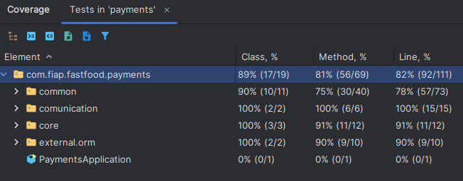

# fiap-postech-payments

# 🚀 FIAP : Challenge Pós-Tech Software Architecture
## 🍔 Microserviço fiap-postech-payments

Microserviço responsável pelos pagamentos, faz parte da Fase 4 da Pós-Graduação de Arquitetura de Sistemas da FIAP.

### 👨‍🏫 Grupo

Integrantes:
- Diego S. Silveira (RM352891)
- Kelvin Vieira (RM352728)
- Wellington Vieira (RM352970)

### 💻 Tecnologias

Tecnologias utilizadas:

* Java 17
* Spring Framework
* Gradle
* PostgreSQL
* Docker
* Swagger
* Cloud AWS
* Kubernetes

### 👓 Serviços Utilizados

* Github
* Postman
* Docker Desktop
* MongoDB Compass
* k9s
* Minikube
* AWS CLI

### 🔌 Integracao dos microserviçoes
A integração dos microservicos é realizada através do Endpoint.

    > Pedido/Order: com.fiap.fastfood.payments.communication.CheckoutController

### 💿 Cobertura de teste

## Version

1.0.0.0